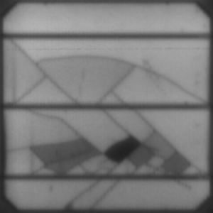
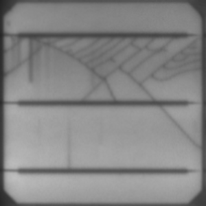
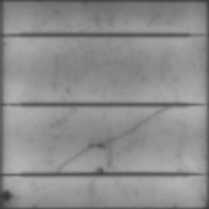

# Multi-label defect detection for Solar Cells from Electroluminescence images of the modules, using Deep Learning

### By [Soroosh Tayebi Arasteh](https://github.com/starasteh/)

This project is a part of the programming exercises of the Deep Learning course (WS 2019-20) offered by the [Pattern Recognition Lab (LME)](https://lme.tf.fau.de/) of the [Computer Science Department](https://www.informatik.uni-erlangen.de/) at [University of Erlangen-Nuremberg (FAU)](https://www.fau.eu/).

Introduction
------
Solar modules are composed of many solar cells. The solar cells are subject to degradation, causing many different types of defects. Defects may occur during transportation or installation of modules as well as during operation, for example due to wind, snow load or hail. Many of the defect types can be found by visual inspection. A common approach is to take electroluminescense images of the modules. To this end, a current is applied to the module, causing the silicon layer to emit light in the near infrared spectrum. This light is then captured by specialized cameras.

### Goal 
In this project, we focus on two different types of defects:
1. **Cracks:** The size of cracks may range from very small cracks (a few pixels in our case) to large cracks that cover the whole cell. In most cases, the performance of the cell is unaffected by this type of defect, since connectivity of the cracked area is preserved.
2. **Inactive** regions: These regions are mainly caused by cracks. It can happen when a part of the cell becomes disconnected and therefore does not contribute to the power production. Hence, the cell performance is decreased.

Of course, the two defect types are related, since an inactive region is often caused by cracks.
However, we treat them as independent and only classify a cell as cracked if the cracks are visible. Further details such as task descriptions and specifications can be found inside ./protocols directory.

Installation of requirements
------

The software is developed in **Python 3.7**.

All Python modules required for the software can be installed from *./utils/environment.yml*.

Code structure
---
1. Everything can be ran from *./main.py*. 
* Set the hyper-parameters and model parameters here. 
* The data preprocessing parameters and directories can be modified from *./configs/config.json*.
* Also, you should first choose an `experiment` name (if you are starting a new experiment) for training, in which all the evaluation and loss value statistics, tensorboard events, and model & checkpoints will be stored. Furthermore, a `config.json` file will be created for each experiment storing all the information needed.
* For testing, just load the experiment which its model you need.

2. The rest of the files:
* *./models/* directory contains the model architecture.
* *./Train_Test_Valid.py* contains the training, validation, and testing processes.
* *./data/data_handler.py* contains data handlers.

Dataset
------
A dataset of 2000 gray-scale 300 by 300 solar cell images is provided here by the [LME](https://lme.tf.fau.de/). The images are provided in png-format. The filenames and the corresponding labels are listed in the `train.csv`. 3 example images are shown below. 
- Top left image: inactive & cracked, top right image: cracked,
- Below image: inactive.

Training
------

The [ResNet18](https://arxiv.org/abs/1512.03385) architecture is implemented initially here in `./models`. But finally, the pre-trained [ResNet34](https://arxiv.org/abs/1512.03385) of `torchvision.models` is used as the initial network architecture as it shows the best performance and trained with the following parameters,

| Name        | Value           |
| :-------------: |:-------------:| 
| Optimizer   | Adam
| Number of epochs | 20 
| Loss function    | Binary Cross Entropy   
| Learning rate  | 7e-5 (fixed)  

Flipping is the only augmentation used on the trainning data.

Results
------
This repository ranked in **the top 3 best models in the Deep Learning Challenge WS1920 of University of Erlangen-Nuremberg**. The trained model is tested on a second data set by the [LME](https://lme.tf.fau.de/) and the results are as follows,

| F1 score of crack | F1 score of inactive  | mean F1 score |
| :-------------: |:-------------:|:-------------:|
| 0.82258 | 0.90909  | 0.86584   

